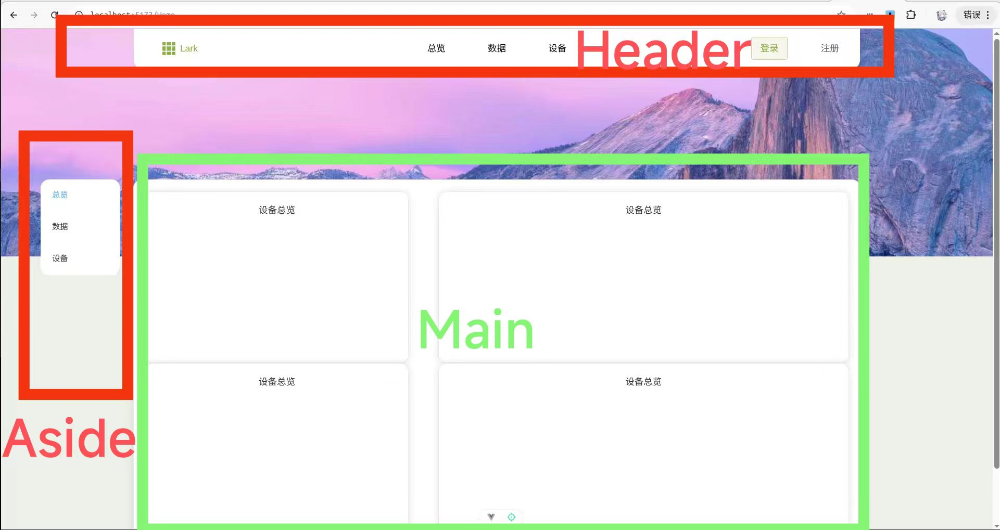

# 前端开发文档
## 主要技术栈
Vue.js + Element Plus + axios

## 文件树结构
```
├── FRONTED_README.md          (本文档)
├── index.html                 HTML入口文件
├── node_modules               node pnpm包安装文件夹
├── package.json               pnpm脚本配置文件
├── pnpm-lock.yaml             版本锁定文件
├── public                     公共资源, "/public"会被映射到"/"
│   ├── banner.jpg             横幅图片
│   └── favicon.ico            网站图标
├── README.md
├── src                        代码文件夹(主要开发位置)
│   ├── App.vue                根组件
│   ├── assets                 资源文件夹(存放公用css js)                 
│   │   └── style.css
│   ├── components             子组件文件夹
│   │   ├── Header.vue
│   │   ├── Home.vue
│   │   ├── Login.vue
│   │   ├── Sider.vue
│   │   └── Stream.vue
│   ├── main.ts                Vue入口文件(注册根组件)
│   └── router                 路由文件夹
│       └── index.ts
├── tsconfig.app.json
├── tsconfig.json
├── tsconfig.node.json
└── vite.config.ts             vite调试配置文件(配置跨域代理)

```

## 主要需求
为用户提供登录注册，进入登录后提供数据总览，详细数据，设备管理等功能

### 页面导航结构.



- **Header** 全局导航栏，电脑端可以考虑固定位置，不随页面活动而移动
  - 主页(Lark)标志: `/Home` 
      - 检查是否登录，未登录进入网站宣传页，已登录则重定向到总览页面

  - 以下三个在未登录状态全部重定向到登录
    - 总览 `/Summary`
    - 数据 `/Details`
    - 设备 `/Devices`

  - 登录 `/Login`
  - 注册 `未定义`

- **Aside** 侧边导航栏
只有在数据和设备页面显示
- 在数据页：
  - 实时
    - 选择特定设备，实时显示选定的设备采集的数据，自动开启视频推流
  - 分析
    - 显示温湿度，环境质量的数据曲线
  - 历史数据
    - 显示特定设备的全部采集数据
- 在设备页
  - 总览 
    - 以卡片形式显示所有已注册设备的状态
  - 管理
    - 设备的增删改查，更新固件，查看日志
  - 日志
    - 具体显示某个设备的详细日志

### 具体页面需求
#### 总览
右侧显示一个鸟厂平面简图，安装设备的位置显示一个颜色点，根据状态显示颜色.

比如已连接数据正常为绿色，数据异常为黄色，未连接为灰色等等，点击对应的颜色点会跳转到数据-实时页面，自动选择点击的设备并展示


左侧是整个鸟厂的状态概览，包含多个卡片，
显示数据状况，厂区平均温湿度空气质量，温湿度空气质量极值
显示设备状况，已注册设备数，连接数，未连接数，状态正常数，异常数

#### 数据 - 实时
右侧显示实时推流图片，右下角提供下载图片的按钮
左侧提供设备选择，展示全部设备，未连接的不可选择
选择设备后自动以默认参数开启推流，下方显示参数设定，包含分辨率，水平翻转，垂直翻转等
监控参数选择，实时应用预览，下方提供恢复默认值和保存设置的按钮